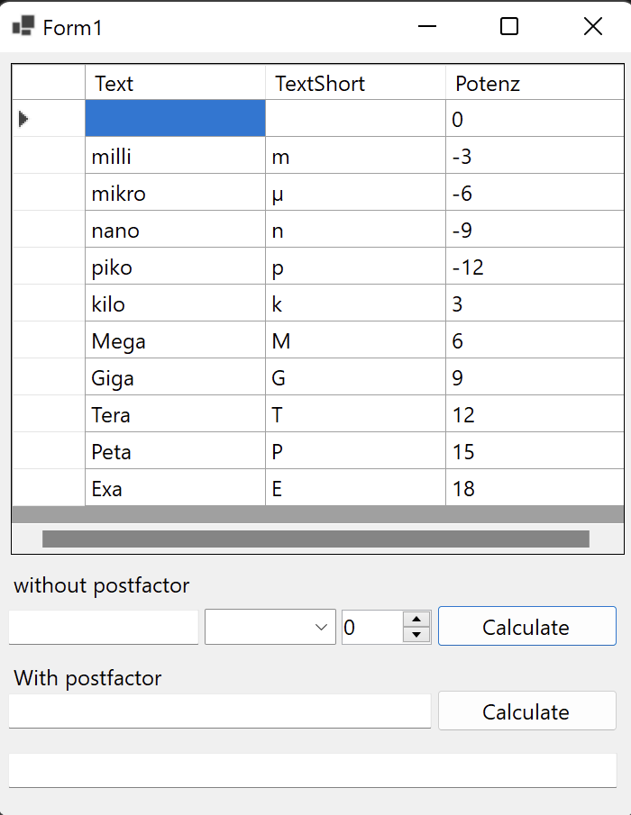

# ValueService
## Features
has two options of on how to input the numbers:  
With postfactor = Converts numbers like 12k to 12000   
Without postfactor = Converts 1000 to 1k normally it chooses the best postfactor but it can be changed manually.

## Images

